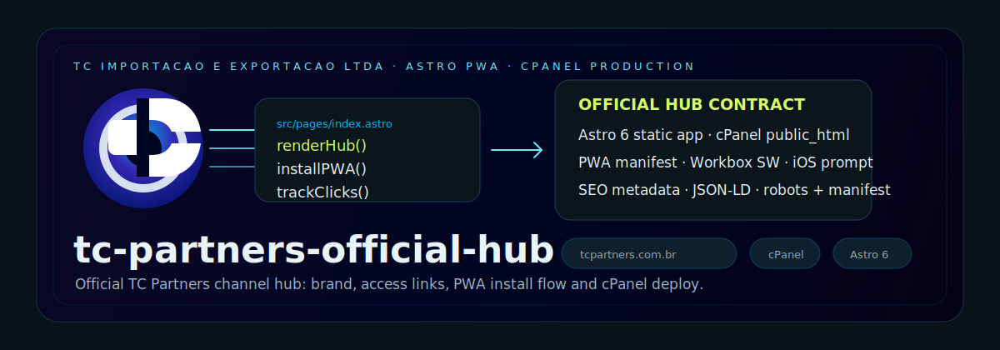

<!-- markdownlint-disable MD003 MD007 MD013 MD022 MD023 MD025 MD029 MD032 MD033 MD034 -->



# TC Partners · Hub Oficial

```text
========================================
   TC PARTNERS · HUB OFICIAL
========================================
Status: ACTIVE
Version: v1.1.0
Stack: Astro 6 · TypeScript · PWA
Deploy: cPanel
========================================
```

> **Cliente:** TC Importação e Exportação LTDA
> **CNPJ:** 24.825.654/0001-12
> **Endereço:** Rua Lauro Muller, 950, Sala 01 Box 271 — Fazenda, Itajaí/SC · CEP 88301-401

────────────────────────────────────────

## ⟠ Objetivo

Portal institucional oficial da TC Partners.
Hub de acesso centralizado aos canais da marca —
leve, rápido e instalável como aplicativo.

Não é "site em construção".
É a camada zero da presença digital oficial.

────────────────────────────────────────

## ⧇ Comandos

```bash
make install      # instalar dependências sem capturar o workspace superior
pnpm run dev      # servidor local http://localhost:4321
pnpm run build    # build de produção → dist/
pnpm run preview  # preview do build estático
```

────────────────────────────────────────

## ⧉ Estrutura

```text
src/
├── components/
│   ├── AccessCard.astro       card individual de acesso
│   ├── AccessGrid.astro       grid dos 4 canais
│   ├── BackgroundMotion.astro fundo: gradiente + rotas SVG + noise
│   ├── ItajaiClock.astro      status bar topo: local + coords + relógio
│   ├── OfficialStatus.astro   badge "TC Importação e Exportação LTDA"
│   ├── PortalHeader.astro     logo única SVG oficial (/logos/tc-logo.svg)
│   ├── PWAPrompt.astro        prompt PWA glassmorphism (canto inferior direito)
│   ├── QRCode.astro           QR aponta tcpartners.com.br (só desktop)
│   ├── SaveContact.astro      botão vCard .vcf com avatar base64
│   └── SplashIntro.astro      splash stroke-draw do símbolo (1x/sessão)
├── data/
│   └── links.ts               4 canais: WhatsApp, E-mail, Instagram, LinkedIn
├── layouts/
│   └── BaseLayout.astro       SEO, meta, JSON-LD, PWA, splash iOS
├── lib/
│   ├── analytics.ts           dispatcher CustomEvent tc:click
│   └── pwa.ts                 service worker helper
├── pages/
│   └── index.astro            página principal
└── styles/
    ├── global.css             reset + base
    ├── motion.css             keyframes (slideUp, scaleIn, fadeIn, etc.)
    └── tokens.css             design tokens (paleta, espaçamento, radius)

public/
├── logos/                     SVGs da marca
├── icons/                     ícones PWA (192px, 512px, apple-touch-icon)
├── splash/                    splash screens iOS (22 arquivos portrait)
├── og/                        Open Graph image
├── robots.txt                 política de indexação
├── favicon.svg / favicon.ico  favicons
└── site.webmanifest           manifesto PWA
```

────────────────────────────────────────

## ◮ Canais (v1)

```text
┏━━━━━━━━━━━━━━━━━━━━━━━━━━━━━━━━━━━━━━━━━━━━━━━━━━━━━━━━━━━
┃ #  CANAL                AÇÃO
┣━━━━━━━━━━━━━━━━━━━━━━━━━━━━━━━━━━━━━━━━━━━━━━━━━━━━━━━━━━━
┃ 1  WhatsApp Comercial   +55 47 99205-1159 + mensagem pré-preenchida
┃ 2  E-mail Corporativo   candido@tcpartners.com.br
┃ 3  Instagram            instagram.com/tcpartnerscomex
┃ 4  LinkedIn             linkedin.com/company/tc-partners-importacoes
┗━━━━━━━━━━━━━━━━━━━━━━━━━━━━━━━━━━━━━━━━━━━━━━━━━━━━━━━━━━━
```

Facebook oficial usado em SEO/JSON-LD, sem card na v1:
`facebook.com/profile.php?id=61590785032838`

────────────────────────────────────────

## ⨀ Tier 1 — entregue

```text
▓▓▓ FUNCIONALIDADES
────────────────────────────────────────
└─ Splash stroke-draw     C desenhado → fill branco → navio no negativo
└─ Status bar iPhone      localização + coordenadas + relógio Itajaí
└─ Logo hero              asset SVG único da marca oficial
└─ Badge institucional    "TC Importação e Exportação LTDA"
└─ PWA instalável         prompt inferior direito, manifest e SW
└─ vCard                  .vcf com avatar base64 (icon-192.png)
└─ QR Code                desktop-only, aponta tcpartners.com.br
└─ Analytics              CustomEvent tc:click em todos os cards
└─ JSON-LD                schema Organization
└─ Splash screens iOS     22 tamanhos portrait
└─ SW otimizado           Workbox via @vite-pwa/astro
└─ Safe-area iPhone       env(safe-area-inset-*) respeitados
```

────────────────────────────────────────

## ⧖ Roadmap

```text
┏━━━━━━━━━━━━━━━━━━━━━━━━━━━━━━━━━━━━━━━━━━━━━━━━━━━━━━━━━━━
┃ VERSÃO   ESCOPO
┣━━━━━━━━━━━━━━━━━━━━━━━━━━━━━━━━━━━━━━━━━━━━━━━━━━━━━━━━━━━
┃ v1       Core + Tier 1 — entregue
┃ v2       Bilíngue PT/EN · painel analytics · OG dinâmico
┃ v3       Site completo · captação B2B · autoridade de marca
┗━━━━━━━━━━━━━━━━━━━━━━━━━━━━━━━━━━━━━━━━━━━━━━━━━━━━━━━━━━━
```

────────────────────────────────────────

## ◬ Pendências com cliente

```text
└─ confirmar font oficial do manual (fonte do wordmark)
```

────────────────────────────────────────

## ◬ Referências

- [BRANDING.md](./BRANDING.md) — design tokens e paleta oficial
- [docs/main-plan.md](./docs/main-plan.md) — plano mestre do projeto

────────────────────────────────────────

```text
▓▓▓ NΞØ MELLØ
────────────────────────────────────────
Core Architect · NΞØ Protocol
neo@neoprotocol.space

"Code is law. Expand until
chaos becomes protocol."

Security by design.
Exploits find no refuge here.
────────────────────────────────────────
```
